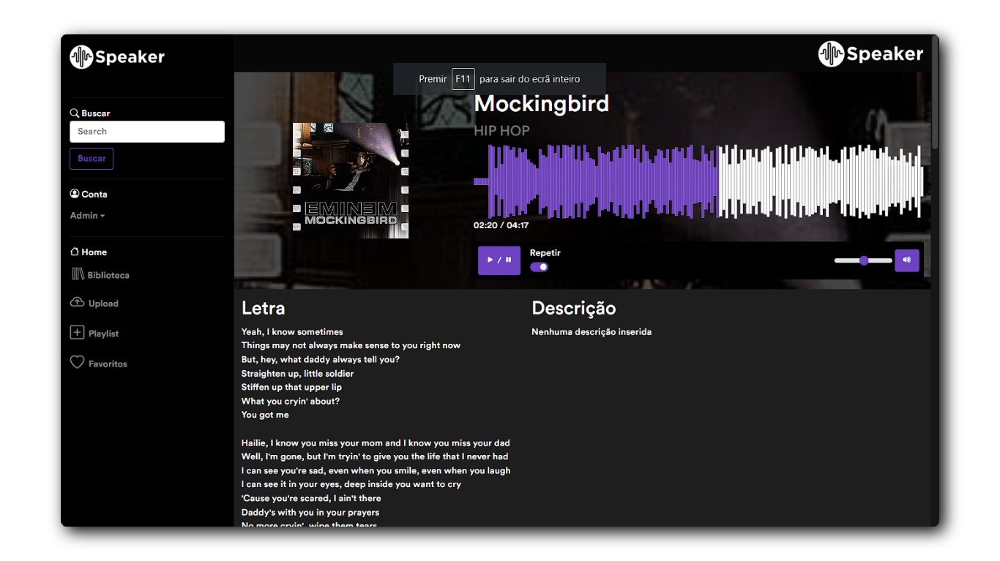

<h1 align="center">
    
    <br>
    Sound Platform: <i>Speaker</i>
</h1>

<div align="center">
    
    
    
    
</div>

<div align="center">


    
</div>

# :page_with_curl: Introduction
<p>
Speaker is an online audio publishing platform built with the Laravel framework. <br>
There you can search, upload and listen to your favorite tracks.
</p>

# :game_die: Features
- [x] Login
- [x] User registration
- [x] Upload audios
- [x] Delete audios
- [x] Edit audios
- [x] Search audios
- [x] Create playlists

# :pushpin: Dependencies
- PHP
- [Composer](https://getcomposer.org/Composer-Setup.exe)
- [SoX - Sound eXchange](https://sourceforge.net/projects/sox/files/latest/download)

# :gear: How to run the application

## You can use our test site
> ❌ Not yet implemented

## In your localhost
1. In your terminal, enter the project folder and run the following commands in sequence:
``` 
composer install
copy .env.example .env
php artisan key:generate
```
2. Open the .env file and configure:
- DATABASE
- MAIL
- set ```FILESYSTEM_DRIVER=public```

3. Open the terminal again and run:
``` 
php artisan migrate
php artisan storage:link
php artisan serve
```
> Open in your browser http://localhost:8000

# :hammer_and_wrench: Technologies
Tools used in the project:
- PHP / LARAVEL 8
- MySQL
- HTML5
- CSS3
- JavaScript
- Bootstrap 5

## :adult: Contributors

<!-- ALL-CONTRIBUTORS-LIST:START - Do not remove or modify this section -->
<!-- prettier-ignore-start -->
<!-- markdownlint-disable -->
<table>
  <tbody>
    <tr>
      <td align="center" valign="top" width="14.28%"><a href="https://www.gustavohenrique.site/"><br /><sub><b>Gustavo Henrique</b></sub></a><br /><a href="#code-Gustavohps10" title="Code">💻</a></td>
    </tr>
  </tbody>
</table>

<!-- markdownlint-restore -->
<!-- prettier-ignore-end -->

<!-- ALL-CONTRIBUTORS-LIST:END -->
